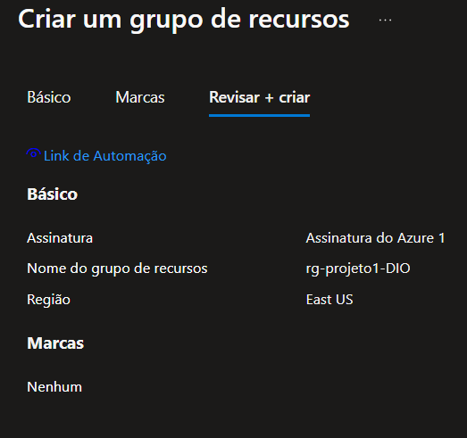
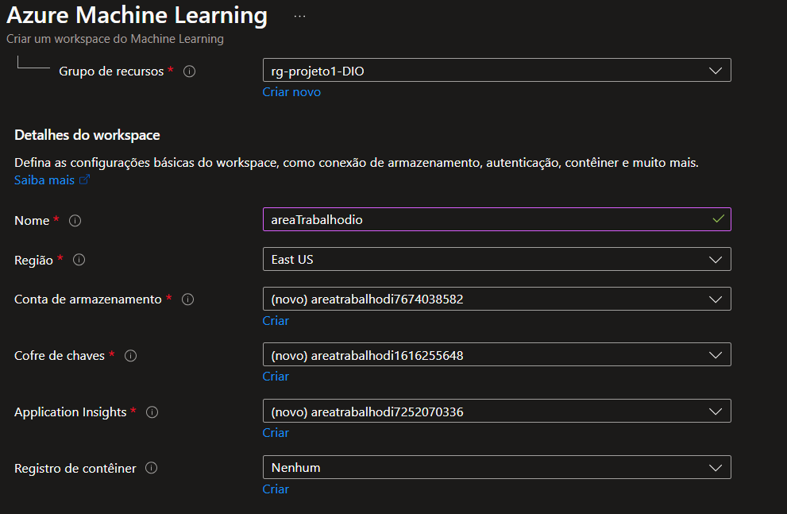
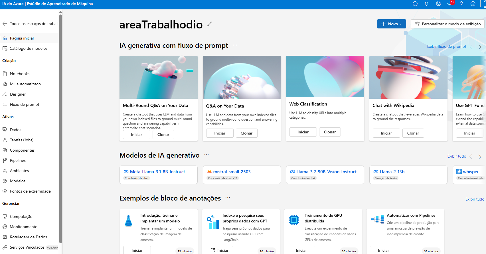
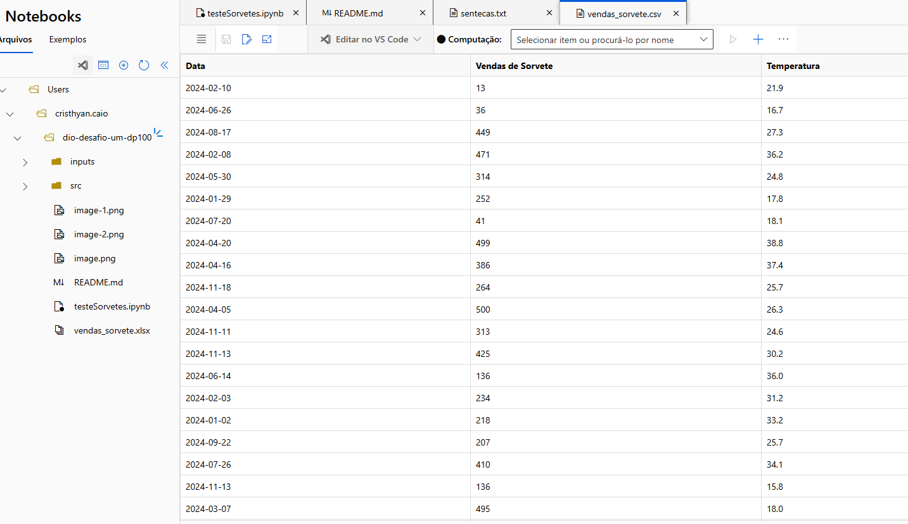
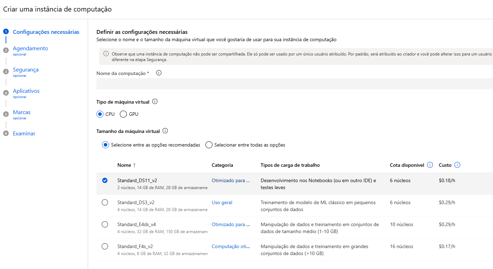

# dio-desafio-um-dp100
Este projeto tem como objetivo utilizar conceitos relacionados ao Azure ML e testar suas ferramentas disponibilizadas.

## Criando um RG para a atividade
Inicialmente, criamos um grupo de recursos onde.

Logo em seguida, criamos uma área de trabalho do Azure ML vinculado ao grupo de recursos recém criado.

Acesso ao Launch do Azure ML

Upload da pasta onde estão presentes os dados que seão analisados e o jupyter nptebook

Criando uma instancia de computação

